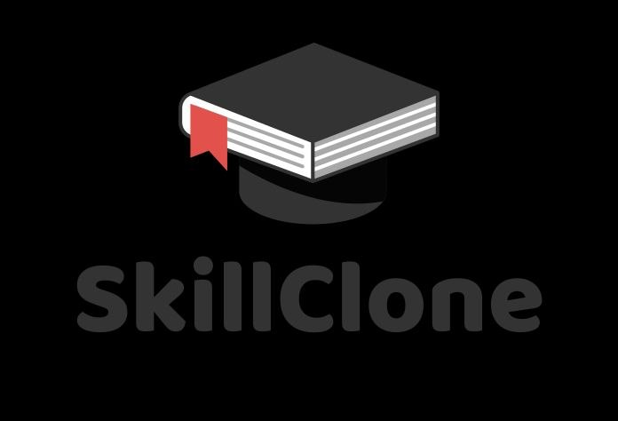

# 🚀 SkillClone - Decentralized AI Mentorship Network

> **Incubator MVP & Production Engineering Specification**  
> SkillClone is a decentralized network of interactive AI teacher agents trained on cloned expert domain knowledge. The platform provides 1-on-1 mentorship with native regional payment options (**Payme**, **Click**, and **Stripe**).



---

## ✨ Key Features & Product Overview

### 🎓 Student Mentorship Hub
* **1-on-1 Interactive Mentor Chat**: Real-time AI response streaming with markdown formatting and code highlighting.
* **Low-Friction Access Models**:
  * **One-Time Skill Unlocks ($15–$49)**: Lifetime unlimited access to expert clones ("Buy once, own forever").
  * **Creator Channel Subscriptions ($9.99/mo)**: Monthly access to evolving creator knowledge streams.
  * **Prepaid Query Bundles**: Flexible query credits ($4.99 / 50 queries).
* **Voice AI Mentorship**: Web Speech API Speech-to-Text (STT) mic input & Text-to-Speech (TTS) voice playback.
* **Interactive Knowledge Checks**: Auto-generated 3-question quizzes based on live conversation context.
* **Knowledge Source Citation**: Drawer displaying exact document snippets cited during mentorship.

### 🛠️ Creator Knowledge Studio
* **Knowledge Document Ingestion**: Drag-and-drop file uploader (PDF, TXT, MD) parsing proprietary notes into vector memory.
* **AI Agent Builder**: Configure creator persona, title, hourly rate, system prompt, and bind vector documents.
* **70/30 Revenue Split Ledger**: Real-time earnings dashboard with instant Payout Withdrawal requests to **Uzbek National Card (Uzcard / Humo via Payme)** or **Click**.

### 🕸️ Knowledge Swarm Network Visualizer
* **SVG Network Topology**: Dynamic graph visualizing multi-agent consensus, node latency, uptime, and vector chunk distribution.

---

## 💳 Localized Payment Adapters (Uzbekistan & Global)
* 🟢 **Payme**: Native phone verification, SMS OTP simulation, UZS currency conversion.
* 🟡 **Click**: Merchant ID & QR code checkout simulation.
* 🟣 **Stripe**: International Visa/Mastercard USD processing.

---

## 🛠️ Technology Stack
* **Frontend**: React 18, Vite, Lucide Icons, Vanilla CSS Glassmorphism Design System.
* **AI Engine**: Hybrid streaming engine supporting OpenAI (GPT-4o) / Gemini APIs + zero-config built-in domain fallback streaming.
* **State Management & Storage**: Persistent LocalStorage with transaction ledger.

---

## ⚡ Quick Start (Local Setup)

```bash
# 1. Clone repository
git clone https://github.com/YOUR_USERNAME/skill-clone.git
cd skill-clone

# 2. Install dependencies
npm install

# 3. Start development server
npm run dev
```

Open `http://localhost:3000/` in your browser.

---

## 🚀 Deploying to Vercel (1-Click)

1. Push this repository to your GitHub account:
   ```bash
   git init
   git add .
   git commit -m "Initial SkillClone Incubator MVP release"
   git branch -M main
   git remote add origin https://github.com/YOUR_USERNAME/skill-clone.git
   git push -u origin main
   ```
2. Go to [Vercel Dashboard](https://vercel.com/new).
3. Import your `skill-clone` repository.
4. Click **Deploy**. Vercel will automatically detect Vite and output your live URL!

---

## 📄 Technical Specification & Scaling Roadmap
For a deep dive into the production SWE/ML architecture (Qdrant, Ray Cluster, vLLM, Firecracker MicroVMs, LoRA Fine-Tuning), read our full [TECHNICAL_SPEC_AND_ROADMAP.md](TECHNICAL_SPEC_AND_ROADMAP.md).
