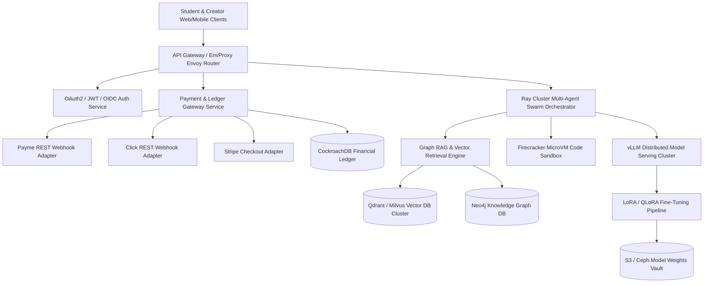
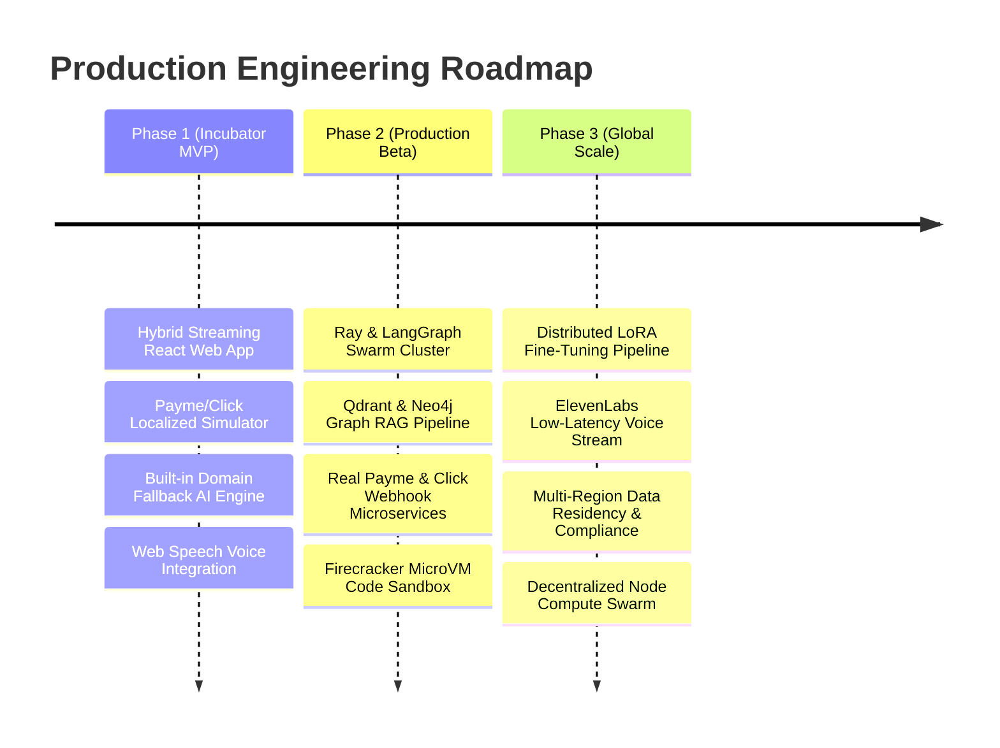

# SkillClone Technical Specification & Production Scaling Roadmap

## 1. Executive Summary & Vision
SkillClone is a decentralized, scalable network of interactive AI teacher agents trained on cloned human domain expertise. The platform enables top domain experts (professors, Silicon Valley tech leaders, historians) to vectorize, fine-tune, and monetize their knowledge into 24/7 autonomous 1-on-1 mentor agents. Students access global mentorship via low-friction models (One-Time Skill Unlocks & Creator Channel Subscriptions) with localized payment gateways (**Payme**, **Click**, and **Stripe**).

This document serves as the living technical specification, infrastructure blueprint, and production engineering roadmap for transitioning from the incubator MVP to a globally distributed, high-throughput multi-agent network.

---

## 2. Global System Architecture

---

## 3. Core Component Specifications

### 3.1 Knowledge Ingestion & Fine-Tuning Pipeline
1. **Multi-Modal Document Parsing**:
   - Audio/Video Ingestion: `Faster-Whisper` + `PyAnnotate` for speaker diarization and transcript generation.
   - Text/Code Parsing: `Unstructured.io` + `LlamaParse` for structured PDF tables, latex math formulas, and GitHub codebase indexing.
2. **Vector Chunking & Graph Ingestion**:
   - Hybrid Retrieval: Semantic chunking (512 tokens with 64-token overlap) stored in **Qdrant** with dense (`bge-large-en-v1.5`) and sparse (`BM25`) hybrid vector search.
   - Knowledge Graph (Graph RAG): Extract entity-relation-entity triplets into **Neo4j** to enable multi-hop reasoning across expert knowledge trees.
3. **Domain Fine-Tuning (LoRA / QLoRA)**:
   - Base Models: LLaMA-3.3 70B Instruct & Qwen-2.5-Coder-32B.
   - Training Pipeline: Automated Unsloth / PEFT pipeline training LoRA adapters (rank $r=16$, $\alpha=32$) on expert transcript Q&A pairs, saved as versioned model weights in S3.

---

### 3.2 Distributed Swarm Orchestration & Code Sandbox
1. **Agent Swarm Runtime**:
   - Microservice Framework: **Ray Core** + **LangGraph** distributed stateful actors running on Kubernetes (EKS/GKE) with auto-scaling GPU worker pools.
   - Model Serving: **vLLM** with PagedAttention and continuous batching across NVIDIA A100/H100 clusters.
2. **Execution Sandbox**:
   - **Firecracker MicroVMs / E2B**: Isolated, ephemeral execution environments (<100ms startup) for running code generated during technical coding mentorship sessions.

---

### 3.3 Ultra-Low Latency Voice AI Engine
1. **Speech-to-Text (STT)**: Deepgram Nova-2 / Faster-Whisper streaming WebSocket connection (<150ms latency).
2. **Text-to-Speech (TTS)**: ElevenLabs / Orpheus zero-shot voice cloning trained on 3-minute voice samples from creator-experts for full-duplex conversational audio.

---

### 3.4 Financial Settlement & Webhook Protocol
1. **Localized Gateway Adapters**:
   - **Payme (Uzbekistan)**: Native HTTP Webhook integration with SHA-256 HMAC header verification, UZS currency conversion, and direct settlement to Uzbek National Bank Cards (Uzcard / Humo 8600/9860).
   - **Click (Uzbekistan)**: REST Merchant API endpoint with Merchant ID verification and QR code billing.
   - **Stripe**: Global card processing using Stripe Elements & Webhook listeners.
2. **Automated Revenue Distribution**:
   - **70% Creator Net Share**: Credited to creator payout ledger in real-time upon successful unlock/subscription purchase.
   - **30% Platform Infrastructure Share**: Reserved for vLLM compute cluster, Qdrant hosting, and system development.

---

## 4. Scalability & Engineering Roadmap

### Phase 1: Incubator MVP (Current State)
- [x] Dual-Portal React + Vite application (Student Mentorship Hub + Creator Knowledge Studio).
- [x] Hybrid AI response engine with OpenAI/Gemini support + instant streaming fallback.
- [x] Payme, Click, and Stripe checkout simulation with live wallet balance & creator 70/30 ledger.
- [x] Web Speech voice interaction (TTS/STT), quiz generator, and interactive Swarm Graph.

### Phase 2: Production Cluster & Webhook Integration (Q4 2026)
- [ ] Deploy **Qdrant Vector DB** cluster on Kubernetes with hybrid dense-sparse index.
- [ ] Implement production **Payme & Click REST Webhook Services** in Node.js/Go with HMAC signature validation and PCI-DSS compliance.
- [ ] Connect **Ray Core + vLLM** serving infrastructure for self-hosted LLaMA-3.3 70B inference.
- [ ] Integrate **E2B Firecracker MicroVMs** for safe multi-language code execution during live mentor chat.

### Phase 3: Global Scale & Decentralized Swarm (Q2 2027)
- [ ] Launch **LoRA Automated Fine-Tuning Pipeline** (Unsloth + Ray Train) allowing creators to train custom model weights directly from YouTube/MP4/PDF uploads.
- [ ] Integrate **Deepgram + ElevenLabs** full-duplex WebRTC streaming voice pipeline (<300ms latency).
- [ ] Implement multi-region data residency (Central Asia, EU, US) with decentralized compute node telemetry.
